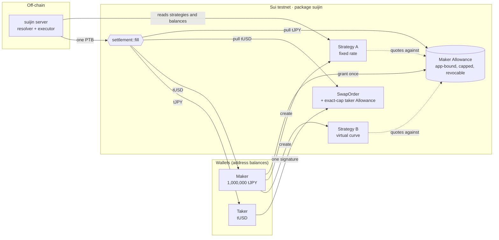
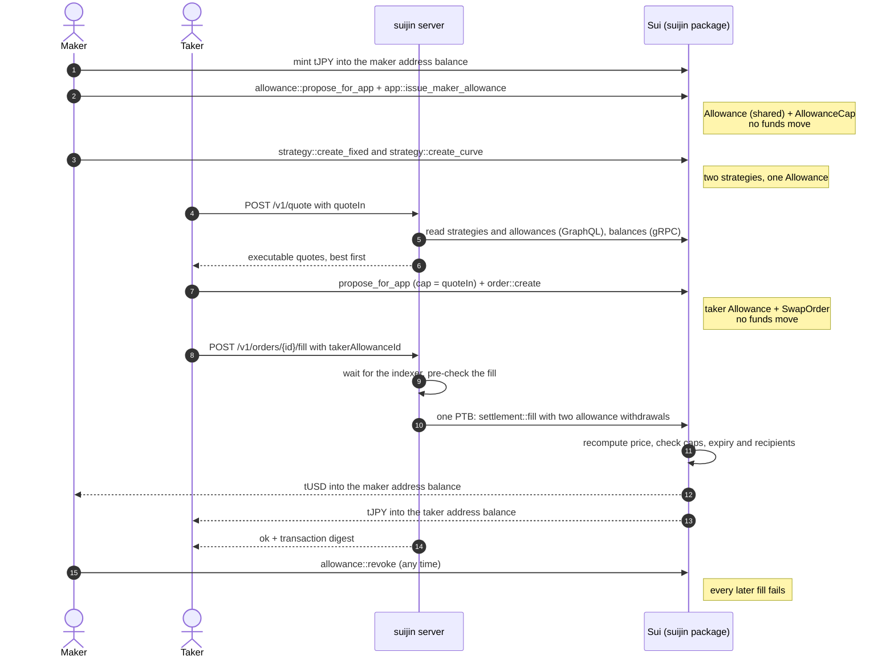
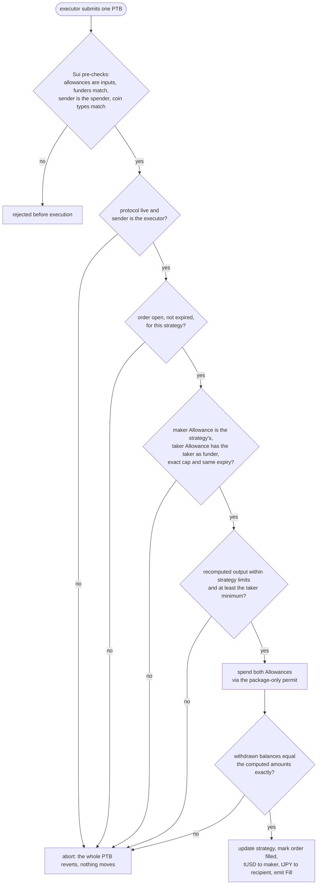
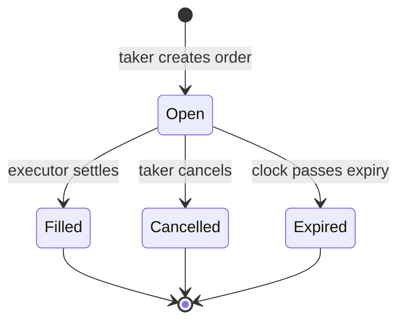

# Suijin: One Balance, Many Markets

**One self-custodial wallet balance can back several market strategies on Sui.** A maker grants one
bounded, revocable, app-bound Allowance. Funds stay in the maker's address balance until a trade
actually settles, and then it settles atomically in a single programmable transaction block (PTB).

Built at ETHGlobal Tokyo 2026 for the Sui DeFi & Payments track. **Testnet only. Unaudited.**

---

## The problem

Market makers and treasuries have to split inventory across venues: some to an AMM, some to limit
orders, some to OTC. Each venue only sees its slice, so every market is thin and most capital sits
idle.

## The idea

Sui now has **address balances** and **native Allowances**. An Allowance is a permission, not a
deposit: the funder names a spender, a cap and an expiry, and can revoke at any time. An
**app-bound** Allowance can only be spent through one Move package, so that package's rules
decide every pull.

Suijin uses one app-bound Allowance as the custody layer for several strategies:



Both strategies advertise the full 1,000,000 tJPY (a **Shared Liquidity Ratio** of 2.0×). Only
1,000,000 real tJPY exists, and every fill draws on the same balance and the same Allowance cap, so
fills can never spend more than is really there.

## A trade, end to end



## What `settlement::fill` checks

The executor chooses **when** to settle, never **what**. Every amount and recipient comes from Move.



## Order lifecycle



`Expired` is logical: the object stays open on chain, but `fill` refuses it.

## Pricing

Both formulas live in `contracts/suijin/sources/math.move` and are mirrored byte-for-byte in
`packages/sdk/src/math.ts`. The same test vectors run in Move and in TypeScript.

- **Fixed rate:** `base_out = floor(quote_in × price_den / price_num)`.
- **Virtual curve:** constant product `x · y = k` on virtual reserves, with the fee taken from the
  input. The new base reserve rounds **up**, so rounding dust always stays with the maker.
- All math runs in u128, so u64 inputs cannot overflow.

## Security model

| The executor can | The executor cannot |
|---|---|
| Delay or censor orders | Change a price or amount: Move recomputes both and checks the withdrawn balances exactly |
| Choose the order of fills | Change a recipient: the maker is fixed in the strategy, the taker's recipient in the order |
| | Spend through any other path: only `suijin::app` can mint a permit, and only `settlement::fill` uses it |
| | Exceed a cap, an expiry or the real balance: the Sui framework enforces these |

The maker can revoke at any time. Revocation deletes the Allowance, so no later fill can even be
built.

## Live on Sui testnet

| Object | ID |
|---|---|
| Package `suijin` | [`0x9d82a68d5c4bbc3630bc9a02953970f4a435edab056f5126af64f59796c0b502`](https://suiscan.xyz/testnet/object/0x9d82a68d5c4bbc3630bc9a02953970f4a435edab056f5126af64f59796c0b502) |
| `ProtocolConfig` | `0x87b126f7464d89a494ea1c61eba8ae4180fcd144e846ab45dd8dc86edf43e494` |
| Executor (spender) | `0x13478f81bc94b611fc8d26f29dff4eba7449a175bf7cf193c9d90bf4970ff8a6` |
| Package `mock_coins` (tUSD, tJPY) | [`0xc3bbdde31c8bba5c5ae568de8aad7edf2e4be4f0023e5fc5a4da3d1e8e5d2ec4`](https://suiscan.xyz/testnet/object/0xc3bbdde31c8bba5c5ae568de8aad7edf2e4be4f0023e5fc5a4da3d1e8e5d2ec4) |
| tUSD faucet | `0xcf668b5b489e7c2d50ed09cf1419aeef80e35975a21bd15a8d462869b295f359` |
| tJPY faucet | `0x7c0dbf7cb90f5216117ab875c7bf3c788f35079aad3f1645e6a6949fffa547ee` |

The same IDs are in `packages/sdk/src/deployment.json`. tUSD and tJPY are test coins with open
faucets and no value. Both use 6 decimals.

## Proof

From `bun run e2e` and `bun run smoke` on testnet:

| Step | Transaction |
|---|---|
| Maker grants one app-bound Allowance | [21UMDykb…](https://suiscan.xyz/testnet/tx/21UMDykb1nC7sjiB5nu9MP7X1ohmhArBhkrJy8atM5Lt) |
| Fixed-rate strategy on that Allowance | [4hJZkUmz…](https://suiscan.xyz/testnet/tx/4hJZkUmzxncJ5w1z8dBfjAoZYSr7m4vhfZtaTJatrHYo) |
| Curve strategy on the same Allowance (zero tJPY moved) | [5sXjSR9C…](https://suiscan.xyz/testnet/tx/5sXjSR9CedaTPTPuNkn1kjbC7pMrJU85eyBPQdBd4VpT) |
| Taker: exact-cap payment Allowance + order, one signature | [JAwmkCVF…](https://suiscan.xyz/testnet/tx/JAwmkCVFiaLTGSbTvx5b936JSNVxHUQazv6wUji6Ggr9) |
| **Fill: one PTB, two Allowance withdrawals** | [4gTnkPqs…](https://suiscan.xyz/testnet/tx/4gTnkPqsS7xaWog9N93tNHK1ba4LV99WSRyWMsyWM6an) |
| Executor asks for more than the quote | refused before execution (abort code 5, `EWrongMakerAmount`) |
| Maker revokes, next fill fails | [3XPqqxYP…](https://suiscan.xyz/testnet/tx/3XPqqxYP9nYmwUNCFkeyjpaNPSmudwcMTxF1SFykjK6L) |
| Fill requested over HTTP right after the order | [2GddsdppM…](https://suiscan.xyz/testnet/tx/2GddsdppM5AZXDPy9oQLwQWNNgjjxKU2xP3NpJKHDTsa) |

## Repository layout

```
contracts/suijin/      Move: app (Allowance binding), math, strategy, order, settlement + 26 tests
contracts/mock_coins/  Move: tUSD and tJPY test coins with open faucets
packages/sdk/          TypeScript: transaction builders, chain reads, math mirror, quote engine
apps/server/           Bun: POST /v1/quote (resolver) and POST /v1/orders/:id/fill (executor)
apps/web/              reserved for the dApp workspace (package manifest only)
scripts/               deploy.ts, e2e.ts (live proof), smoke-server.ts (live HTTP test)
docs/superpowers/plans implementation plan with every design decision
```

## Run it

You need Bun 1.3+ and the Sui CLI **1.80 or newer** (`brew upgrade sui`). Older CLIs have no
`sui::allowance`.

```bash
bun install
cp .env.example .env           # fill EXECUTOR_, MAKER_, TAKER_SECRET_KEY (suiprivkey1...)
bun run deploy                 # publishes with the executor key, writes deployment.json
bun run server                 # resolver + executor on http://localhost:8790
bun run e2e                    # live end-to-end proof (needs funded maker and taker)
bun run smoke                  # live HTTP test against the running server
```

Tests:

```bash
cd contracts/suijin && sui move test   # 26 Move tests
bun run test:ts                        # 24 TypeScript tests
bunx tsc -p tsconfig.json              # typecheck sdk, server, scripts
```

## API for frontends

All amounts are integer strings in base units (6 decimals for tUSD and tJPY).

| Endpoint | Body | Response |
|---|---|---|
| `GET /v1/health` | | `{ ok, network, executor }` |
| `GET /v1/strategies` | | every strategy with its live state |
| `POST /v1/quote` | `{ "quoteIn": "10000000" }` | executable quotes, best first: `strategyId, kind, maker, makerAllowanceId, quoteIn, baseOut, minBaseOut, expiresAtMs` |
| `POST /v1/orders/{orderId}/fill` | `{ "takerAllowanceId": "0x…" }` | `{ ok: true, digest }`, or `{ ok: false, error }` with HTTP 409 |

Fill errors include `ORDER_ALREADY_FILLED`, `ORDER_EXPIRED`, `STRATEGY_PAUSED`,
`ALLOWANCE_REVOKED`, `WRONG_TAKER_ALLOWANCE` and `SLIPPAGE_EXCEEDED`. Repeating a fill request
returns the same digest while the server process is running. After a restart the answer is
`ORDER_ALREADY_FILLED`. The on-chain order status is the real replay guard.

The wallet side comes from `@suijin/sdk`. Every builder returns an unsigned `Transaction`:

```ts
import { createTakerOrder } from '@suijin/sdk';

const [best] = await fetch(`${SERVER}/v1/quote`, {
  method: 'POST',
  headers: { 'content-type': 'application/json' },
  body: JSON.stringify({ quoteIn: '10000000' }),
}).then((r) => r.json());

const tx = createTakerOrder({
  strategyId: best.strategyId,
  quoteIn: BigInt(best.quoteIn),
  minBaseOut: BigInt(best.minBaseOut),
  quotedBaseOut: BigInt(best.baseOut),
  expiresAtMs: Date.now() + 5 * 60_000,
  recipient: account.address,
});
// Sign with the wallet, then read the effects with { effects: true, objectTypes: true }:
// the created '::order::SwapOrder<' is orderId, the created '::allowance::Allowance<' is takerAllowanceId.
await fetch(`${SERVER}/v1/orders/${orderId}/fill`, {
  method: 'POST',
  headers: { 'content-type': 'application/json' },
  body: JSON.stringify({ takerAllowanceId }),
});
```

The other builders:
- Maker: `issueMakerAllowance`, `createFixedStrategy`, `createCurveStrategy`, `setStrategyActive`, `revokeAllowance`
- Taker: `cancelOrder`
- Test coins: `mintTestCoin`

The readers are `listStrategies`, `getStrategy`, `getOrder`, `getAllowance`, `listAllowanceCaps` and
`addressBalance`.

## Positioning

- **DeepBook** unifies order flow.
- **STEAMM** optimizes deposited liquidity.
- **Suijin** multiplexes self-custodial maker inventory before it is committed to any venue.

The shared-liquidity insight comes from 1inch Aqua; Aqua0 explored it on EVM. Suijin rebuilds it
on Sui primitives: address balances, app-bound Allowances and PTBs.

## What we do not claim

- The Shared Liquidity Ratio is availability, not TVL, not collateral and not leverage.
- Not every advertised position can fill at the same time.
- An Allowance is a permission, not a guarantee: a maker can move their funds at any time.
- The single executor can delay or censor orders.
- Allowances are enabled on Sui testnet and devnet, not yet on mainnet (checked 26 Sep 2026).
- This code is unaudited hackathon software.

## Roadmap

- Signed RFQ quotes: price updates cost nothing.
- Oracle-priced and stable curves.
- Dutch auctions.
- A pause-only risk guard.
- A bonded solver network.
- DeepBook routing.
- Managed liquidity through operator caps.
- Pay with any token.
- Mainnet, once Allowances ship there and after an audit.
