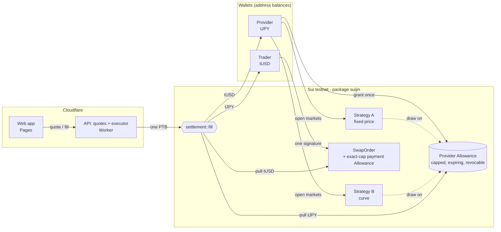

<p align="center">
  
</p>

<h1 align="center">Suijin</h1>

<p align="center">
  <b>One balance, many markets.</b><br>
  Self-custodial shared liquidity on Sui, built on native app-bound Allowances.
</p>

<p align="center">
  <a href="https://suijin-app.pages.dev"><b>Live app</b></a> ·
  <a href="https://suijin-api.xfajarr-web3.workers.dev/v1/health">API</a> ·
  <a href="https://suiscan.xyz/testnet/object/0x9d82a68d5c4bbc3630bc9a02953970f4a435edab056f5126af64f59796c0b502">Package on Suiscan</a> ·
  <a href="#proof-on-testnet">Proof transactions</a>
</p>

<p align="center">
  ETHGlobal Tokyo 2026 · <b>Sui track: DeFi &amp; Payments</b> · Sui testnet · Unaudited hackathon code
</p>

---

## Summary

Putting tokens to work on-chain usually means **depositing** them into a pool, an order book or a
vault. Each deposit locks a separate slice of your balance, hands custody to a contract, and serves
only one venue.

Suijin removes the deposit. A provider grants **one Sui Allowance**: a native permission that is
capped, expiring, revocable and bound to Suijin's Move package. Funds stay in the provider's own
wallet. That single Allowance can back **several markets at once** (a curve, a fixed price, limit
orders), and every trade settles atomically in **one programmable transaction block** that pulls
both sides through their Allowances.

On top of that primitive the web app ships four products:

| Feature | What the user does | What happens underneath |
|---|---|---|
| **Swap** | Trade any two tokens (tUSD, tJPY, SUI, USDC, DEEP, or any coin added by type), typing the amount in or the amount out | The trader signs an exact-cap payment Allowance + order; the executor settles both sides in one PTB |
| **Pay** | Send someone an exact amount in the coin they want, or share a payment link | Exact-output quote; the order's recipient is the merchant, who gets at least the target |
| **Earn** | Provide liquidity from a wallet: curve or fixed price, fee tier, depth, one or two sides | Budgets are Allowances; one budget can back many markets, nothing is deposited |
| **Limit** | Sell at a chosen price, cancel any time | A fixed-price market on its own budget; cancel = revoke the Allowance |
| **Portfolio** | See balances, budgets, markets, approvals and fills; pause or revoke | Reads the wallet's Allowances, strategies and `Fill` events |

## Sui features used

| Sui primitive | How Suijin uses it |
|---|---|
| **App-bound Allowances** (`sui::allowance`) | The custody layer. Providers' budgets and traders' payment approvals are Allowances whose spender is the executor and whose app is `suijin::app::App`. Only Suijin's package can mint the spend permit. |
| **Address balances** | Coins live in plain wallet balances; settlement pulls from them with `tx.withdrawal({ from: 'allowance' })` and delivers with `balance::send_funds`. |
| **Programmable transaction blocks** | One fill = one PTB with two Allowance withdrawals. Two budgets or two markets are created in one PTB. |
| **Shared objects** | `Strategy` and `SwapOrder` are shared, so any executor transaction can settle them. |
| **gRPC + GraphQL** | GraphQL for discovery and history (paginated); gRPC fullnode reads for anything that prices or settles, so quotes match what Move recomputes. |
| **dApp Kit** | Wallet connection and signing in the web app. |

## How it works



**1. Provide (Earn, Limit).** The provider signs one transaction that creates an Allowance
(`allowance::propose_for_app` + `app::issue_maker_allowance`): spender = executor, cap = budget,
with an expiry. No funds move. A second transaction opens markets on it
(`strategy::create_fixed` / `create_curve`). Opening another market on the same budget needs only
that second step: both markets advertise the same balance, which is the *Shared Liquidity Ratio*
(2.0× here), and every fill still draws on one real balance and one cap.

**2. Quote.** The API finds strategies for the requested direction, re-reads them from a fullnode,
and caps each route by what can really settle: the provider's balance, the budget left, the
market's remaining size and its per-fill limit. Paused, expired and revoked markets are skipped.
Best route first; the minimum received is enforced later on-chain.

**3. Order (Swap, Pay).** The trader signs one transaction: an Allowance for **exactly** the quoted
input, valid for five minutes, plus a `SwapOrder` (market, minimum out, recipient, expiry). Nothing
moves yet. For Pay, the order's recipient is the merchant and the quote is exact-output.

**4. Settle.** The executor submits one PTB calling `settlement::fill`, which pulls the provider's
coins and the trader's payment through their Allowances and delivers both sides. The executor
chooses **when** to settle, never **what**:

```mermaid
sequenceDiagram
    autonumber
    actor Trader
    participant API as API (executor)
    participant Move as settlement::fill
    Trader->>API: POST /v1/quote
    API-->>Trader: executable routes, best first
    Trader->>Move: sign payment Allowance + SwapOrder (no funds move)
    Trader->>API: POST /v1/orders/{id}/fill
    API->>API: fresh reads, pre-check the fill
    API->>Move: one PTB, two Allowance withdrawals
    Move->>Move: executor? order open? right Allowances?<br/>recompute price, output ≥ minimum,<br/>withdrawn amounts exact?
    Move-->>Trader: output to recipient's address balance
    Move-->>Trader: Fill event, order marked filled
```



If any check fails, the whole PTB reverts and nothing moves. The executor pays settlement gas; the
trader only pays for the order.

**5. Manage (Portfolio).** Pause or resume a market (`strategy::set_active`), revoke a budget
(`allowance::revoke`, every market on it stops), revoke an unspent payment approval, and review
fills from `settlement::Fill` events.

### Pricing

- **Fixed price:** `base_out = floor(quote_in × price_den / price_num)`. One rate for every fill;
  the fee tier is baked into the price as a spread.
- **Curve:** constant product `x · y = k` on **virtual** reserves, fee taken from the input. Depth
  (1×, 2×, 5× the budget) sets how far the price moves before the budget sells out.
- Formulas live in `contracts/suijin/sources/math.move`, run in u128, round in the provider's
  favour, and are mirrored exactly in `packages/sdk/src/math.ts` with shared test vectors.

### Security model

| The executor can | The executor cannot |
|---|---|
| Delay or censor orders | Change a price or amount: Move recomputes both and checks the withdrawn balances exactly |
| Choose the order of fills | Change a recipient: fixed in the strategy and the order |
| | Spend any other way: only `suijin::app` mints the spend permit, and only `settlement::fill` uses it |
| | Exceed a cap, an expiry or a real balance: the Sui framework enforces these |

Providers can revoke at any time; revocation deletes the Allowance, so no later fill can be built.
Traders approve an exact amount that expires in five minutes, and each order fills at most once.

## How it's made

- **Move** (`contracts/suijin`): five modules. `app` binds Allowances to the package and owns the
  only spend path; `math`, `strategy`, `order`, `settlement`. 26 Move tests. `contracts/mock_coins`
  provides tUSD and tJPY with open faucets.
- **TypeScript SDK** (`packages/sdk`, `@mysten/sui` 2.33): transaction builders for every entry
  point, a quote engine (exact input and exact output), GraphQL and gRPC readers, and the Move math
  mirrored for off-chain pricing.
- **API** (`apps/server`): one fetch handler for quotes and fills. It runs on Bun locally and as a
  **Cloudflare Worker** in production, with the executor key stored as a Worker secret.
- **Web app** (`apps/web`): React 19, Vite and `@mysten/dapp-kit-react`, deployed on **Cloudflare
  Pages**. No UI framework; hand-written CSS with skeleton loading, toasts and a transaction stepper.
- **Tooling:** Bun workspaces, 39 TypeScript tests, live end-to-end scripts that run real testnet
  transactions against a local or deployed API.

Notable problems solved during the hackathon:

- **Indexer lag.** Quotes priced on GraphQL state sometimes failed at settlement after a trade
  moved the curve. Quotes and the executor now read from a fullnode over gRPC, and exact-output
  orders carry a slippage buffer on the input.
- **Racing the fullnode.** A fill request can arrive before the order is visible; the executor
  retries its reads briefly before planning the fill.
- **Two transactions for a new budget.** A shared Allowance cannot be used in the same PTB that
  created it, so granting a budget and opening markets on it are two signatures (one when reusing a
  budget).

## Deployments

| | |
|---|---|
| Web app | https://suijin-app.pages.dev |
| API | https://suijin-api.xfajarr-web3.workers.dev |
| Package `suijin` | [`0x9d82a68d…b502`](https://suiscan.xyz/testnet/object/0x9d82a68d5c4bbc3630bc9a02953970f4a435edab056f5126af64f59796c0b502) |
| `ProtocolConfig` | `0x87b126f7464d89a494ea1c61eba8ae4180fcd144e846ab45dd8dc86edf43e494` |
| Executor (Allowance spender) | `0x13478f81bc94b611fc8d26f29dff4eba7449a175bf7cf193c9d90bf4970ff8a6` |
| Package `mock_coins` | [`0xc3bbdde3…2ec4`](https://suiscan.xyz/testnet/object/0xc3bbdde31c8bba5c5ae568de8aad7edf2e4be4f0023e5fc5a4da3d1e8e5d2ec4) |
| tUSD faucet | `0xcf668b5b489e7c2d50ed09cf1419aeef80e35975a21bd15a8d462869b295f359` |
| tJPY faucet | `0x7c0dbf7cb90f5216117ab875c7bf3c788f35079aad3f1645e6a6949fffa547ee` |

All IDs are also in `packages/sdk/src/deployment.json`. tUSD and tJPY are test coins with no
value; both use 6 decimals.

## Proof on testnet

| Step | Transaction |
|---|---|
| Provider grants one app-bound Allowance | [21UMDykb…](https://suiscan.xyz/testnet/tx/21UMDykb1nC7sjiB5nu9MP7X1ohmhArBhkrJy8atM5Lt) |
| Fixed-price strategy on that Allowance | [4hJZkUmz…](https://suiscan.xyz/testnet/tx/4hJZkUmzxncJ5w1z8dBfjAoZYSr7m4vhfZtaTJatrHYo) |
| Curve strategy on the same Allowance (zero tJPY moved) | [5sXjSR9C…](https://suiscan.xyz/testnet/tx/5sXjSR9CedaTPTPuNkn1kjbC7pMrJU85eyBPQdBd4VpT) |
| Trader: exact-cap payment Allowance + order, one signature | [JAwmkCVF…](https://suiscan.xyz/testnet/tx/JAwmkCVFiaLTGSbTvx5b936JSNVxHUQazv6wUji6Ggr9) |
| **Fill: one PTB, two Allowance withdrawals** | [4gTnkPqs…](https://suiscan.xyz/testnet/tx/4gTnkPqsS7xaWog9N93tNHK1ba4LV99WSRyWMsyWM6an) |
| Executor asks for more than the quote | refused before execution (`EWrongMakerAmount`) |
| Provider revokes, the next fill fails | [3XPqqxYP…](https://suiscan.xyz/testnet/tx/3XPqqxYP9nYmwUNCFkeyjpaNPSmudwcMTxF1SFykjK6L) |
| Fill requested over HTTP right after the order | [2GddsdppM…](https://suiscan.xyz/testnet/tx/2GddsdppM5AZXDPy9oQLwQWNNgjjxKU2xP3NpJKHDTsa) |
| Pay from the web app: recipient gets exactly 5 tUSD, payer spends tJPY | [B7nUsT7E…](https://suiscan.xyz/testnet/tx/B7nUsT7EnQUDnEpfjyzLz69KHgKyYr7cHbQDRThwRhc6) · [6GphQuaG…](https://suiscan.xyz/testnet/tx/6GphQuaGGtFg6w3DhJGRq7vaahQ63JpDJFTVckTyS2qm) |

## Try it

1. Open **https://suijin-app.pages.dev** and connect a Sui wallet set to **testnet**.
2. Get testnet SUI for gas (the header links to the Sui faucet when your balance is zero), then
   press **Faucet** for 1,000 tUSD and 150,000 tJPY.
3. **Swap** a few tUSD for tJPY, or **Pay** an exact amount to any address.
4. **Earn**: open a two-sided market, then open a second one on the existing budget and watch the
   shared-liquidity figure in **Portfolio**.
5. **Limit**: place a sell order above the market price, then cancel it from the orders table.

## Run locally

Requirements: Bun 1.3+ and the Sui CLI **1.80 or newer** (older CLIs have no `sui::allowance`).

```bash
bun install
cp .env.example .env      # EXECUTOR_, MAKER_ (provider), TAKER_ (trader) SECRET_KEY = suiprivkey1...
bun run server            # API on http://localhost:8790 (uses the testnet deployment in deployment.json)
bun run web               # web app on http://localhost:5173
```

<details>
<summary>More commands: deploy contracts, live tests, Cloudflare deploy, burner wallet</summary>

```bash
bun run deploy            # publish the Move packages with the executor key, write deployment.json
bun run e2e               # live end-to-end proof (needs funded provider and trader keys)
bun run smoke             # live HTTP test against a running API
bun run smoke:defi        # two-sided liquidity, reverse swap and exact-output payment over HTTP
SERVER_URL=https://suijin-api.xfajarr-web3.workers.dev bun run smoke:defi   # against the deployed API

cd contracts/suijin && sui move test   # 26 Move tests
bun run test:ts                        # 39 TypeScript tests
bun run typecheck                      # sdk, server, scripts and web app
```

Cloudflare (after `bunx wrangler login`):

```bash
cd apps/server && bunx wrangler deploy
grep ^EXECUTOR_SECRET_KEY= ../../.env | cut -d= -f2- | bunx wrangler secret put EXECUTOR_SECRET_KEY
cd ../web && bun run deploy:pages
```

The web app reads `VITE_SERVER_URL` (default `http://localhost:8790`; production builds use
`apps/web/.env.production`). `VITE_BURNER=1 bun run web` adds an in-browser burner wallet for
rehearsals without an extension.

</details>

## Repository layout

```
contracts/suijin/      Move: app, math, strategy, order, settlement (+ 26 tests)
contracts/mock_coins/  Move: tUSD and tJPY test coins with open faucets
packages/sdk/          TypeScript SDK: builders, readers, quote engine, math mirror
apps/server/           API: quotes + executor (Bun locally, Cloudflare Worker live)
apps/web/              Web app: Swap, Pay, Earn, Limit, Portfolio
scripts/               deploy, live end-to-end and smoke tests
docs/                  implementation plan and assets
```

<details>
<summary>API reference</summary>

All amounts are integer strings in base units (6 decimals). In code, `maker` means provider and
`taker` means trader.

| Endpoint | Body | Response |
|---|---|---|
| `GET /v1/health` | | `{ ok, network, executor, api }` |
| `GET /v1/strategies` | | every strategy with its state |
| `POST /v1/quote` | `{ "sell": "tUSD", "buy": "tJPY", "amountIn": "10000000", "slippageBps": 50 }` | routes, best first: `strategyId, kind, maker, makerAllowanceId, baseType, quoteType, quoteIn, baseOut, minBaseOut, expiresAtMs, impactBps, feeBps` |
| `POST /v1/orders/{orderId}/fill` | `{ "takerAllowanceId": "0x…" }` | `{ ok: true, digest }`, or `{ ok: false, error }` with HTTP 409 |

`sell` and `buy` accept `tUSD`, `tJPY` or full coin types, in either direction. Send `amountIn`
(exact input) or `amountOut` (exact output: `minBaseOut` equals the target and `quoteIn` carries the
`slippageBps` buffer). `slippageBps` is 0 to 1000, default 100. Fill errors include
`ORDER_ALREADY_FILLED`, `ORDER_EXPIRED`, `STRATEGY_PAUSED`, `ALLOWANCE_REVOKED`,
`WRONG_TAKER_ALLOWANCE` and `SLIPPAGE_EXCEEDED`; the on-chain order status is the replay guard.

</details>

<details>
<summary>SDK usage</summary>

Every builder in `@suijin/sdk` returns an unsigned `Transaction`:

```ts
import { createTakerOrder } from '@suijin/sdk';

const [best] = await fetch(`${API}/v1/quote`, {
  method: 'POST',
  headers: { 'content-type': 'application/json' },
  body: JSON.stringify({ sell: 'tUSD', buy: 'tJPY', amountIn: '10000000' }),
}).then((r) => r.json());

const tx = createTakerOrder({
  strategyId: best.strategyId,
  quoteIn: BigInt(best.quoteIn),
  minBaseOut: BigInt(best.minBaseOut),
  quotedBaseOut: BigInt(best.baseOut),
  expiresAtMs: Date.now() + 5 * 60_000,
  recipient: account.address,
  pair: { base: best.baseType, quote: best.quoteType },
});
// Sign, then read effects with { effects: true, objectTypes: true }: the created
// '::order::SwapOrder<' is the orderId, the created '::allowance::Allowance<' the takerAllowanceId.
await fetch(`${API}/v1/orders/${orderId}/fill`, {
  method: 'POST',
  headers: { 'content-type': 'application/json' },
  body: JSON.stringify({ takerAllowanceId }),
});
```

- Provider: `issueMakerAllowance`, `issueAllowances`, `createFixedStrategy`, `createCurveStrategy`,
  `createStrategies`, `setStrategyActive`, `revokeAllowance`
- Trader: `createTakerOrder`, `cancelOrder`
- Test coins: `mintTestCoin`, `mintTestCoins`
- Readers: `listStrategies`, `getStrategy`, `getOrder`, `getAllowance`, `listAllowanceCaps`,
  `listFills`, `addressBalance` (GraphQL) and `freshStrategies`, `freshAllowances`, `freshOrder`
  (gRPC, no indexer lag)

</details>

## Positioning

- **DeepBook** unifies order flow. **STEAMM** optimizes deposited liquidity. **Suijin** lets
  self-custodial balances serve many markets before anything is committed to a venue.
- The shared-liquidity idea comes from 1inch Aqua (explored on EVM by Aqua0). Suijin rebuilds it on
  Sui primitives, and the settlement model is close to intent systems like UniswapX, using native
  Allowances instead of off-chain signatures.

## Limitations

- The Shared Liquidity Ratio is availability, not TVL, collateral or leverage: not every advertised
  market can fill at the same time.
- An Allowance is a permission, not a guarantee; a provider can move funds, and fills then fail.
- A single executor can delay or censor orders (it cannot steal).
- Prices are set by providers; there is no oracle yet.
- Sui Allowances are live on testnet and devnet only, not yet on mainnet.
- Unaudited hackathon code.

## Roadmap

Signed RFQ quotes · oracle-priced and stable curves · Dutch auctions · a bonded solver network
instead of one executor · DeepBook routing · managed liquidity through operator caps · pay with any
token · mainnet once Allowances ship there, after an audit.
