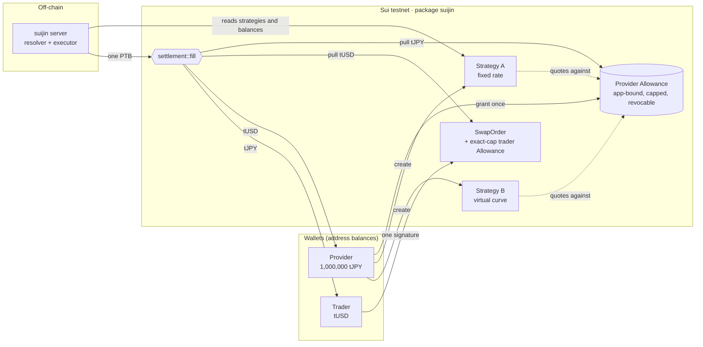
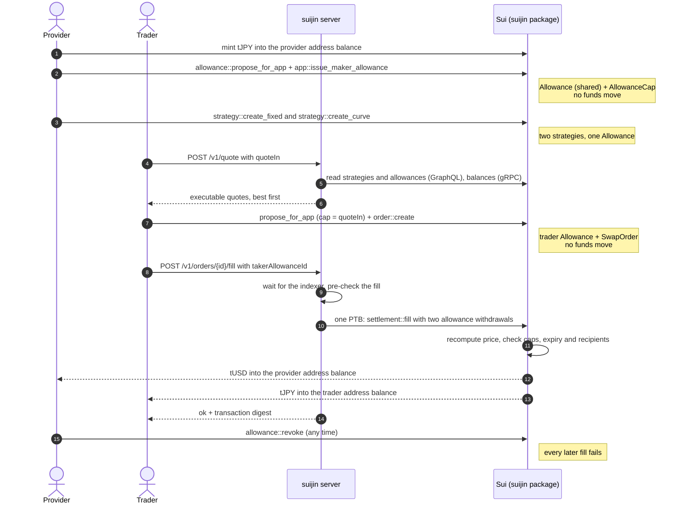
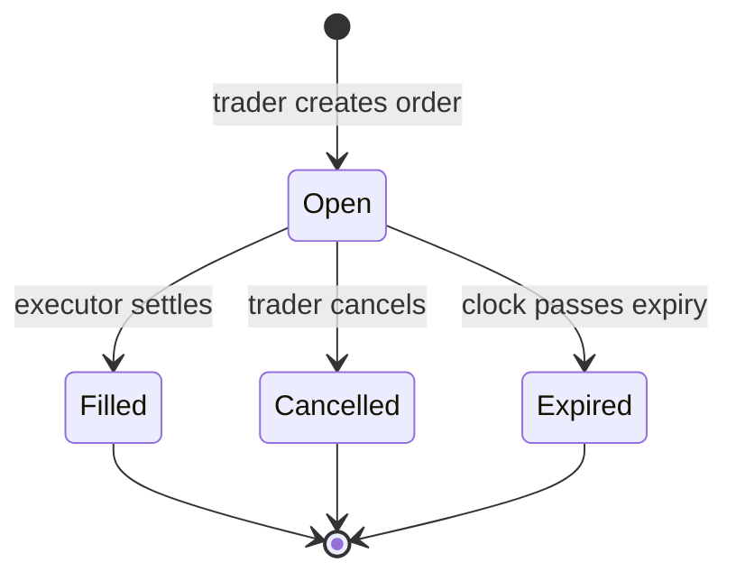

<p align="center">
  
</p>

<h1 align="center">Suijin</h1>

<p align="center"><b>One balance, many markets.</b></p>

**One self-custodial wallet balance can back several markets on Sui.** A provider grants one bounded,
revocable, app-bound Allowance. Funds stay in the provider's own address balance until a trade
actually settles, and then it settles atomically in a single programmable transaction block (PTB).

Built at ETHGlobal Tokyo 2026 for the Sui DeFi & Payments track. **Testnet only. Unaudited.**

| Term | Meaning |
|---|---|
| **Provider** | Anyone who makes their tokens available to trade: a person, a DAO treasury, a token team, a payments app, a market maker. Called `maker` in the code. |
| **Trader** | Anyone who swaps against that liquidity. Called `taker` in the code. |
| **Allowance** | A native Sui permission: "this spender may pull up to X of my tokens until time T." Not a deposit. |
| **Executor** | The service that submits settlement transactions. It can only act through Suijin's Move rules. |

---

## The problem

Putting tokens to work on-chain almost always means **depositing them** into an AMM pool, an order
book, a lending market or a vault. Every deposit:

- **locks a separate slice** of your balance, so the same tokens can serve only one venue at a time;
- **hands custody to a contract**, so you carry that protocol's risk and must withdraw to get your
  funds back;
- **sits idle** whenever that venue is quiet.

This hits everyone who holds tokens, not only professionals:

- a person who wants to sell part of their balance at a target price;
- a DAO or token team supporting its own market;
- a payments app holding stablecoin float;
- a market maker quoting several pairs.

Liquidity ends up thin and fragmented, and capital stays locked where it is least needed.

## The idea

Sui now has **address balances** and **native Allowances**. An Allowance is a permission, not a
deposit: the owner names a spender, a cap and an expiry, and can revoke at any time. An
**app-bound** Allowance can only be spent through one Move package, so that package's rules
decide every pull.

Suijin uses one app-bound Allowance as the custody layer for several markets at once:



Both strategies advertise the full 1,000,000 tJPY, a **Shared Liquidity Ratio** of 2.0×. Only
1,000,000 real tJPY exists, and every fill draws on the same balance and the same Allowance cap, so
fills can never spend more than is really there. The provider never deposits anything.

## A trade, end to end



## What `settlement::fill` checks

The executor chooses **when** to settle, never **what**. Every amount and recipient comes from Move.


## Order lifecycle



`Expired` is logical: the object stays open on chain, but `fill` refuses it.

## Pricing

Both formulas live in `contracts/suijin/sources/math.move` and are mirrored byte-for-byte in
`packages/sdk/src/math.ts`. The same test vectors run in Move and in TypeScript.

- **Fixed rate:** `base_out = floor(quote_in × price_den / price_num)`.
- **Virtual curve:** constant product `x · y = k` on virtual reserves, with the fee taken from the
  input. The new base reserve rounds **up**, so rounding dust always stays with the provider.
- All math runs in u128, so u64 inputs cannot overflow.

## Security model

| The executor can | The executor cannot |
|---|---|
| Delay or censor orders | Change a price or amount: Move recomputes both and checks the withdrawn balances exactly |
| Choose the order of fills | Change a recipient: the provider is fixed in the strategy, the trader's recipient in the order |
| | Spend through any other path: only `suijin::app` can mint a spend permit, and only `settlement::fill` uses it |
| | Exceed a cap, an expiry or the real balance: the Sui framework enforces these |

The provider can revoke at any time. Revocation deletes the Allowance, so no later fill can even be
built.

## Live on Sui testnet

| Object | ID |
|---|---|
| Package `suijin` | [`0x9d82a68d5c4bbc3630bc9a02953970f4a435edab056f5126af64f59796c0b502`](https://suiscan.xyz/testnet/object/0x9d82a68d5c4bbc3630bc9a02953970f4a435edab056f5126af64f59796c0b502) |
| `ProtocolConfig` | `0x87b126f7464d89a494ea1c61eba8ae4180fcd144e846ab45dd8dc86edf43e494` |
| Executor (spender) | `0x13478f81bc94b611fc8d26f29dff4eba7449a175bf7cf193c9d90bf4970ff8a6` |
| Package `mock_coins` (tUSD, tJPY) | [`0xc3bbdde31c8bba5c5ae568de8aad7edf2e4be4f0023e5fc5a4da3d1e8e5d2ec4`](https://suiscan.xyz/testnet/object/0xc3bbdde31c8bba5c5ae568de8aad7edf2e4be4f0023e5fc5a4da3d1e8e5d2ec4) |
| tUSD faucet | `0xcf668b5b489e7c2d50ed09cf1419aeef80e35975a21bd15a8d462869b295f359` |
| tJPY faucet | `0x7c0dbf7cb90f5216117ab875c7bf3c788f35079aad3f1645e6a6949fffa547ee` |

The same IDs are in `packages/sdk/src/deployment.json`. tUSD and tJPY are test coins with open
faucets and no value. Both use 6 decimals.

## Proof

From `bun run e2e` and `bun run smoke` on testnet:

| Step | Transaction |
|---|---|
| Provider grants one app-bound Allowance | [21UMDykb…](https://suiscan.xyz/testnet/tx/21UMDykb1nC7sjiB5nu9MP7X1ohmhArBhkrJy8atM5Lt) |
| Fixed-rate strategy on that Allowance | [4hJZkUmz…](https://suiscan.xyz/testnet/tx/4hJZkUmzxncJ5w1z8dBfjAoZYSr7m4vhfZtaTJatrHYo) |
| Curve strategy on the same Allowance (zero tJPY moved) | [5sXjSR9C…](https://suiscan.xyz/testnet/tx/5sXjSR9CedaTPTPuNkn1kjbC7pMrJU85eyBPQdBd4VpT) |
| Trader: exact-cap payment Allowance + order, one signature | [JAwmkCVF…](https://suiscan.xyz/testnet/tx/JAwmkCVFiaLTGSbTvx5b936JSNVxHUQazv6wUji6Ggr9) |
| **Fill: one PTB, two Allowance withdrawals** | [4gTnkPqs…](https://suiscan.xyz/testnet/tx/4gTnkPqsS7xaWog9N93tNHK1ba4LV99WSRyWMsyWM6an) |
| Executor asks for more than the quote | refused before execution (abort code 5, `EWrongMakerAmount`) |
| Provider revokes, next fill fails | [3XPqqxYP…](https://suiscan.xyz/testnet/tx/3XPqqxYP9nYmwUNCFkeyjpaNPSmudwcMTxF1SFykjK6L) |
| Fill requested over HTTP right after the order | [2GddsdppM…](https://suiscan.xyz/testnet/tx/2GddsdppM5AZXDPy9oQLwQWNNgjjxKU2xP3NpJKHDTsa) |
| Web app, Pay: recipient gets exactly 5 tUSD, payer spends tJPY (order) | [B7nUsT7E…](https://suiscan.xyz/testnet/tx/B7nUsT7EnQUDnEpfjyzLz69KHgKyYr7cHbQDRThwRhc6) |
| Web app, Pay: settlement on the reverse market | [6GphQuaG…](https://suiscan.xyz/testnet/tx/6GphQuaGGtFg6w3DhJGRq7vaahQ63JpDJFTVckTyS2qm) |

## Repository layout

```
contracts/suijin/      Move: app (Allowance binding), math, strategy, order, settlement + 26 tests
contracts/mock_coins/  Move: tUSD and tJPY test coins with open faucets
packages/sdk/          TypeScript: transaction builders, chain reads, math mirror, quote engine
apps/server/           Bun: POST /v1/quote (resolver) and POST /v1/orders/:id/fill (executor)
apps/web/              web app: Swap, Pay, Earn, Limit, Portfolio (React + dApp Kit)
scripts/               deploy.ts, e2e.ts (live proof), smoke-server.ts, smoke-defi.ts (live HTTP tests)
docs/superpowers/plans implementation plan with every design decision
```

## Run it

You need Bun 1.3+ and the Sui CLI **1.80 or newer** (`brew upgrade sui`). Older CLIs have no
`sui::allowance`.

```bash
bun install
cp .env.example .env           # EXECUTOR_, MAKER_ (provider), TAKER_ (trader) SECRET_KEY = suiprivkey1...
bun run deploy                 # publishes with the executor key, writes deployment.json
bun run server                 # resolver + executor on http://localhost:8790
bun run e2e                    # live end-to-end proof (needs funded provider and trader keys)
bun run smoke                  # live HTTP test against the running server
bun run smoke:defi             # two-sided liquidity, reverse swap and exact-output payment over HTTP
bun run web                    # web app on http://localhost:5173
```

The web app reads `VITE_SERVER_URL` (default `http://localhost:8790`). To rehearse without a wallet
extension, start it with `VITE_BURNER=1`: dApp Kit then offers an in-browser burner wallet (fund it
with testnet SUI, then press Faucet for tUSD and tJPY).

Tests:

```bash
cd contracts/suijin && sui move test   # 26 Move tests
bun run test:ts                        # 39 TypeScript tests
bunx tsc -p tsconfig.json              # typecheck sdk, server, scripts
```

## API for frontends

All amounts are integer strings in base units (6 decimals for tUSD and tJPY). Field and function
names use the code's terms: `maker` means provider, `taker` means trader.

| Endpoint | Body | Response |
|---|---|---|
| `GET /v1/health` | | `{ ok, network, executor }` |
| `GET /v1/strategies` | | every strategy with its live state |
| `POST /v1/quote` | `{ "sell": "tUSD", "buy": "tJPY", "amountIn": "10000000", "slippageBps": 50 }` | executable quotes, best first: `strategyId, kind, maker, makerAllowanceId, baseType, quoteType, quoteIn, baseOut, minBaseOut, expiresAtMs, impactBps, feeBps` |
| `POST /v1/orders/{orderId}/fill` | `{ "takerAllowanceId": "0x…" }` | `{ ok: true, digest }`, or `{ ok: false, error }` with HTTP 409 |

Quote bodies: `sell` and `buy` are `tUSD`, `tJPY` or full coin types, in either direction. Send
`amountIn` (exact input: most output first) or `amountOut` (exact output, as Pay uses: cheapest input
first, `minBaseOut` equals the target and `quoteIn` carries the `slippageBps` buffer). `slippageBps`
is 0 to 1000, default 100. The original `{ "quoteIn": "…" }` body still means pay tUSD, receive tJPY.
Quotes are priced from fullnode state, not the indexer, so they match what settlement recomputes.

Fill errors include `ORDER_ALREADY_FILLED`, `ORDER_EXPIRED`, `STRATEGY_PAUSED`,
`ALLOWANCE_REVOKED`, `WRONG_TAKER_ALLOWANCE` and `SLIPPAGE_EXCEEDED`. Repeating a fill request
returns the same digest while the server process is running. After a restart the answer is
`ORDER_ALREADY_FILLED`. The on-chain order status is the real replay guard.

The wallet side comes from `@suijin/sdk`. Every builder returns an unsigned `Transaction`:

```ts
import { createTakerOrder } from '@suijin/sdk';

const [best] = await fetch(`${SERVER}/v1/quote`, {
  method: 'POST',
  headers: { 'content-type': 'application/json' },
  body: JSON.stringify({ quoteIn: '10000000' }),
}).then((r) => r.json());

const tx = createTakerOrder({
  strategyId: best.strategyId,
  quoteIn: BigInt(best.quoteIn),
  minBaseOut: BigInt(best.minBaseOut),
  quotedBaseOut: BigInt(best.baseOut),
  expiresAtMs: Date.now() + 5 * 60_000,
  recipient: account.address,
  pair: { base: best.baseType, quote: best.quoteType },
});
// Sign with the wallet, then read the effects with { effects: true, objectTypes: true }:
// the created '::order::SwapOrder<' is orderId, the created '::allowance::Allowance<' is takerAllowanceId.
await fetch(`${SERVER}/v1/orders/${orderId}/fill`, {
  method: 'POST',
  headers: { 'content-type': 'application/json' },
  body: JSON.stringify({ takerAllowanceId }),
});
```

The other builders (each takes an optional `pair`; the default market sells tJPY for tUSD):
- Provider: `issueMakerAllowance`, `issueAllowances` (several budgets, one PTB), `createFixedStrategy`,
  `createCurveStrategy`, `createStrategies` (several markets, one PTB), `setStrategyActive`, `revokeAllowance`
- Trader: `cancelOrder`
- Test coins: `mintTestCoin`, `mintTestCoins`

The readers are `listStrategies`, `getStrategy`, `getOrder`, `getAllowance`, `listAllowanceCaps`,
`listFills` and `addressBalance` (GraphQL, for discovery and history), plus `freshStrategies`,
`freshAllowances` and `freshOrder` (gRPC, no indexer lag, for anything that prices or settles).

## Web app

| Page | What a user does | What it shows about the mechanism |
|---|---|---|
| Swap | Trade either direction, typing the amount in or the amount out | One signature: an exact-cap payment Allowance plus the order. The executor settles both sides in one PTB and pays that gas |
| Pay | Send someone an exact amount in the coin they want, or share a request link | Exact-output quotes: the recipient gets at least the target, any surplus goes to them |
| Earn | Provide both sides of a market from one wallet: curve or fixed price, fee tier, depth | Budgets are Allowances. One budget can back several markets: nothing is deposited |
| Limit | Place fixed-price sell orders | A fixed-price strategy on its own budget. Nothing is locked while it waits |
| Portfolio | See budgets, markets, unspent approvals and fills | Revoking deletes the Allowance, and every market on it stops |

## Positioning

- **DeepBook** unifies order flow.
- **STEAMM** optimizes deposited liquidity.
- **Suijin** lets self-custodial balances serve many markets before anything is committed to a
  venue.

The shared-liquidity insight comes from 1inch Aqua; Aqua0 explored it on EVM. Suijin rebuilds it
on Sui primitives: address balances, app-bound Allowances and PTBs.

## What we do not claim

- The Shared Liquidity Ratio is availability, not TVL, not collateral and not leverage.
- Not every advertised position can fill at the same time.
- An Allowance is a permission, not a guarantee: a provider can move their funds at any time.
- The single executor can delay or censor orders.
- Allowances are enabled on Sui testnet and devnet, not yet on mainnet (checked 26 Sep 2026).
- This code is unaudited hackathon software.

## Roadmap

- Signed RFQ quotes: price updates cost nothing.
- Oracle-priced and stable curves.
- Dutch auctions.
- A pause-only risk guard.
- A bonded solver network.
- DeepBook routing.
- Managed liquidity through operator caps.
- Pay with any token.
- Mainnet, once Allowances ship there and after an audit.
